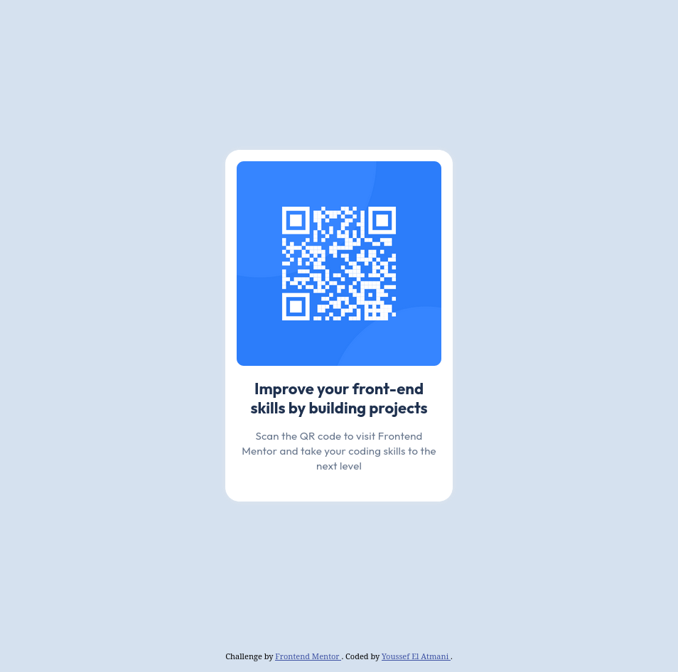
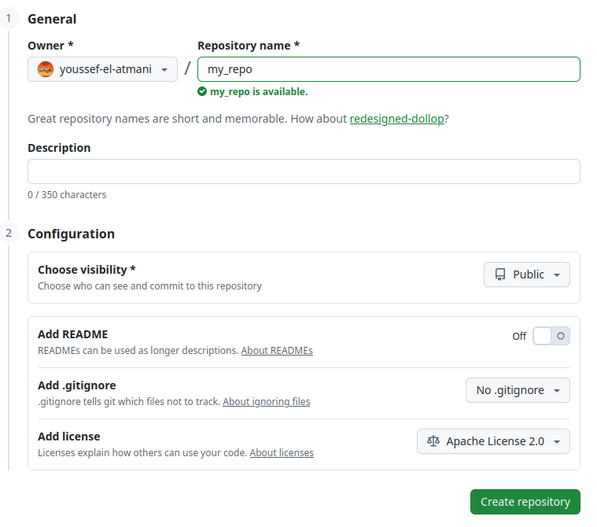
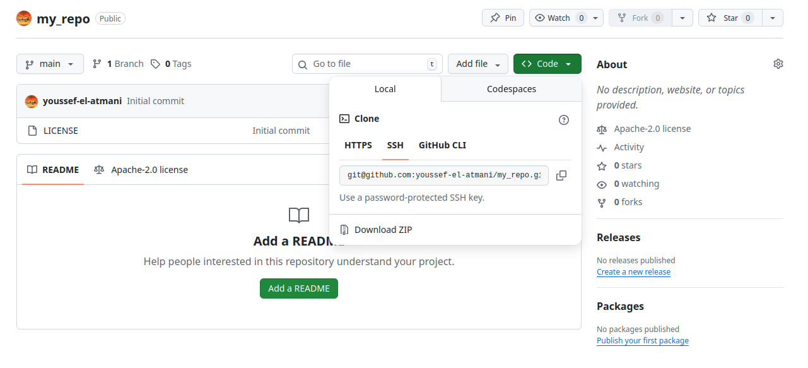

# Frontend Mentor - QR code component solution

This is a solution to the [QR code component challenge on Frontend Mentor](https://www.frontendmentor.io/challenges/qr-code-component-iux_sIO_H). Frontend Mentor challenges help you improve your coding skills by building realistic projects.

## Table of contents

- [Overview](#overview)
  - [Screenshot](#screenshot)
  - [Links](#links)
- [My process](#my-process)
  - [Built with](#built-with)
  - [What I learned](#what-i-learned)
  - [Continued development](#continued-development)
  - [Useful resources](#useful-resources)
- [Author](#author)
- [Acknowledgments](#acknowledgments)

**Note: Delete this note and update the table of contents based on what sections you keep.**

## Overview

### Screenshot



### Links

- Live Site URL: [Add live site URL here](https://youssef-el-atmani.github.io/QR-component/)

## My process

### Built with

- Semantic HTML5 markup
- Flexbox

### What I learned

Despite the project being simple and straightforward, and even the my goal from the project was to get familiar with the workflow of building front-end mentor project .. I did learn quit great things

#### Responsiveness

- I learned how to make the components more responsive by using `width` and `height` with `min` and `max` prefix like `min-height`.

For example, if I want the **body** element to cover all the `view-height`, I could do:

```css
body {
  height: 100vh;
}
```

That will work just fine, but the problem with that is that if the body content updated later, and if it requires more space an overflow will happen
by making

```css
body {
  min-height: 100vh;
}
```

We keep our page responsive, if there is more content, automatically there will be enough space for it, an no overflow will occur.

#### Moving hidden elements

Hidden elements are elements that starts with `.` like `.gitignore`.

- I learned how to move `hidden elements` from the terminal using: `mv .* ./destination_folder`.

The reason I needed that is the way I initialize my project.
To provide more details, let us see the process suggested by Frontend-Mentor:

##### Frontend mentor workflow

1. Create a new repo in GitHub, the repo should be empty, let's name it `my_project_repo`
2. Create a folder on your desktop for your new project, let's name it `my_project_folder`
3. You place the initial content provided by Frontend Mentor for that specific project into `my_project_folder`
4. and then you run the following from the terminal:

```md
git init
git add .
git commit -m "first commit"
git branch -M main
git remote add origin https://github.com/<username>/git-test.git
git push -u origin main
```

The above workflow didn't work for me, because that require the new created repo in github `my_project_repo` to be empty.
In my case, I like to add a `LICENSE` when I create a new public repo, which mean that linking the local folder to the remote repo would not work using that above workflow.
It could be followed by adding some tweaks .. I tried to do that, but because I don't have big knowledge with git, I moved to a straightforward approach.

Even if someone read this that starts with an empty repo, I think knowing this method is worth knowing for someone that is completely new to git world.

##### The other workflow

My workflow goes like this:

1. Create a new repo in gitHub,let's name it `my_repo`, the repo doesn't have to be empty.
   
   As it is shown, I have choose an `Apache License`.
2. After clicking `Create repository`, I got to the following:
   
3. After that, clicking on the `<> code` green button, and choosing `SSH`, and copy that URL, in my case it is :

```md
git@github.com:youssef-el-atmani/my_repo.git
```

4. Go to the terminal and navigate to the local directory that you want your project to be and run the following:

```md
git clone git@github.com:youssef-el-atmani/my_repo.git
```

5. That's it, now a new folder will be created locally, that have the exact things as the remote github-repo, you're free to keep that name, or change it.
6. Now you can add the initial code provided by frontend mentor, by copying the content into the your project folder. The problem here is that you can't copy hidden files, such as `.gitignore`, and here where `mv {*,.*} ./f_m_project ./my_repo` is used.
   - The `f_m_project` means `frontend_mentor_project`.
   - `*`: selects everything exists in `./f_m_project` except the hidden files such as `.gitignore`.
   - `.*`: selects everything that starts with `.` such as `.gitignore`, meaning it selects the hidden files.
7. Now you can simply commit the new added files: `git commit -m "Add initial assets & code provided by frontend mentor`.
8. You can now start working on the project, and whenever you want to push you work to github, you simply run: `git push origin main`.

## Author

- Frontend Mentor - [@youssef-el-atmani](https://www.frontendmentor.io/profile/youssef-el-atmani)
